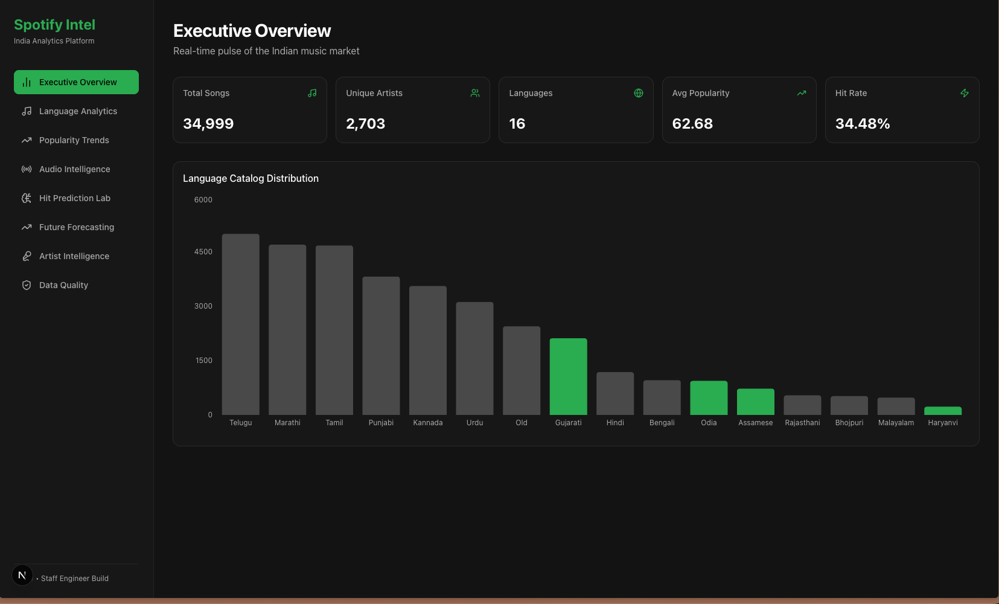
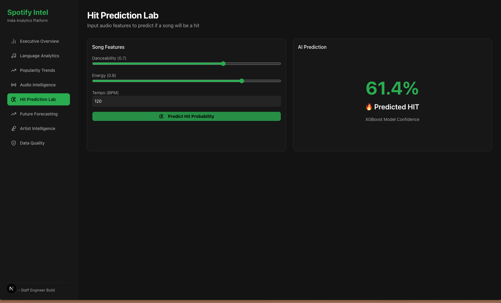
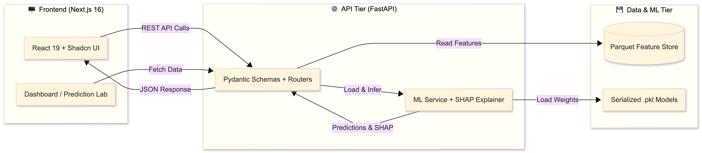

# 🎵 Spotify India Intelligence Platform

An AI-powered, full-stack analytics platform that analyzes Indian music consumption trends across 16 languages, forecasts regional popularity, and predicts hit songs using Machine Learning.


---

## 📸 Application Sneak Peek

| Executive Overview Dashboard | Hit Prediction AI Lab |
|:---:|:---:|
|  |  |
| *Real-time KPIs & Language Distribution* | *Interactive XGBoost predictions with custom inputs* |

---

## 🎯 The Business Problem

Spotify India operates in a highly fragmented, multilingual market. A one-size-fits-all recommendation engine fails to capture regional nuances, leaving growth opportunities on the table for Punjabi, Tamil, Telugu, and other regional markets. 

**The Solution:** An internal intelligence dashboard that empowers Product Managers, Music Strategists, and Regional Growth Teams to:
1. Understand which languages are gaining momentum.
2. Identify what audio profiles drive success regionally.
3. Predict whether a track will be a hit *before* allocating marketing spend.

---

## 🏗️ System Architecture

This project follows a strict separation of concerns, utilizing a modern AI/SaaS architecture:



---

## ⚙️ Tech Stack

| Category | Technologies |
|---|---|
| **Frontend** | Next.js 16, React 19, Tailwind CSS v4, Shadcn UI, Recharts, Lucide Icons |
| **Backend** | FastAPI, Pydantic V2, Uvicorn, CORS Middleware |
| **Machine Learning** | XGBoost, SHAP, Scikit-Learn, Statsmodels (Holt-Winters) |
| **Data Engineering** | Pandas, NumPy, PyArrow (Parquet), `uv` Package Manager |
| **Version Control** | Git, GitHub |

---

## 🧠 Key Engineering & ML Insights

### 1. The "Popularity Floor" Data Bias
During the data audit, I discovered the dataset was pre-filtered to a minimum popularity of 25. The model is blind to truly unpopular songs, which required adjusting the Hit/Non-Hit classification threshold and documenting this limitation for business stakeholders.

### 2. Regression to Classification Pivot
Initial attempts to predict exact popularity scores (Regression) yielded only 5% R². Music popularity is heavily driven by non-linear external factors (movies, marketing). Pivoting to Hit Classification (>=75 popularity) provided a robust, business-valuable model (40% precision on hits).

### 3. SHAP Explainability over Accuracy
A 57% accurate model that explains *why* it made a choice is 100x more valuable than a black-box model. SHAP analysis revealed that **Artist Star Power** (`artist_target_enc`) dominates hit predictions, outweighing audio features like danceability.

### 4. React 19 & Next.js 16 Compatibility
Navigated the Tailwind v4 CSS variable migration and resolved Recharts hydration bugs by strictly separating Server Components (data fetching) from Client Components (charts/interactivity).

---

## 🚀 Local Setup & Installation

### Prerequisites
- Python 3.12+
- Node.js 18+
- [uv](https://github.com/astral-sh/uv) (Python package manager)

### 1. Clone the Repository
```bash
git clone https://github.com/manasscodes/Spotify-Music-Intelligence-India.git
cd Spotify-Music-Intelligence-India
```

### 2. Backend Setup (FastAPI)
```bash
# Create and activate virtual environment
uv venv
source .venv/bin/activate  # On Windows: venv\Scripts\activate

# Install Python dependencies
uv pip install -r requirements.txt

# Run Data Pipeline & Train Models (Generates .pkl files)
python scripts/consolidate_data.py
python scripts/clean_data.py
python scripts/generate_quality_report.py
python scripts/feature_engineering.py
python scripts/save_models.py

# Start FastAPI Server
uvicorn backend.app.main:app --reload --port 8000
```
*The Backend API will be live at `http://localhost:8000/docs`*

### 3. Frontend Setup (Next.js)
Open a new terminal window:
```bash
cd frontend

# Install Node dependencies
npm install

# Start Next.js Development Server
npm run dev
```
*The Dashboard will be live at `http://localhost:3000`*

---

## 📂 Project Structure

```text
spotify-india-intelligence/
│
├── assets/                         # Visuals for README
│   ├── architecture.png
│   ├── dashboard-overview.png
│   └── hit-prediction-lab.png
│
├── backend/
│   └── app/
│       ├── main.py                 # FastAPI entry point
│       ├── routers/                # API endpoints (Prediction, Analytics)
│       ├── services/               # Business logic & ML loading
│       └── schemas/                # Pydantic request/response models
│
├── data/
│   ├── raw/                        # Original CSVs (Gitignored)
│   ├── processed/                  # Cleaned Parquet files (Gitignored)
│   └── models/                     # Serialized .pkl models (Gitignored)
│
├── frontend/
│   ├── app/                        # Next.js App Router pages
│   ├── components/                 # UI components (Shadcn, Charts, Layout)
│   └── lib/                        # API helpers and utilities
│
├── notebooks/                      # Jupyter Notebooks (EDA, Training, SHAP)
├── scripts/                        # Data pipeline & model training scripts
└── requirements.txt                # Python dependencies
```

---

## 🗺️ Roadmap

- [x] **Phase 1-5:** Data Pipeline, Cleaning, Feature Engineering
- [x] **Phase 6-9:** XGBoost Classification, Forecasting, SHAP Explainability
- [x] **Phase 10-11:** FastAPI Backend, Next.js Executive Dashboard, Hit Prediction Lab
- [ ] **Phase 12:** Audio Intelligence Radar Charts
- [ ] **Phase 13:** Future Forecasting Visualizations
- [ ] **Phase 14:** Cloud Deployment (Vercel + Railway + Neon PostgreSQL)

---

## 📄 License

This project is open source and available under the [MIT License](LICENSE).

---

Built with ☕ and 🎵 by [Manas Kolaskar](https://github.com/manasscodes)
